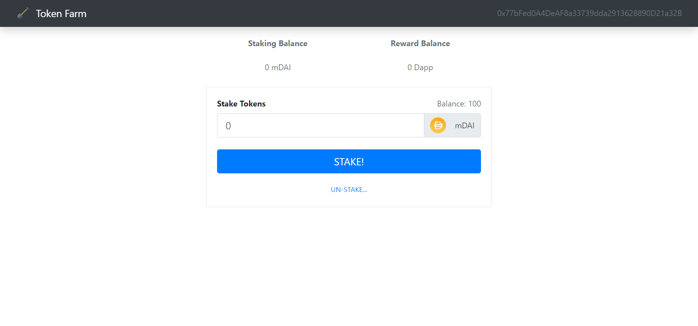

# Token-Farm
Token Farm is a defi app where you can deposit mock Dai tokens and earn rewards.




## Tech Stack

**Frontend:** HTML, CSS, React, Bootstrap

**Backend:** Solidity


## Run Locally

Clone the project

```
git clone https://github.com/SrijanDas/Token-Farm.git
```

Go to the directory

```
cd Token-Farm
```

Install dependencies

```bash
npm install
```

Start the app

```bash
npm start
```


That's it👍

## Thank you 😃

[](https://srijan-das.web.app/)
[](https://www.linkedin.com/in/srijan-das-3591791b3)
[](https://twitter.com/Srijan_1805)

